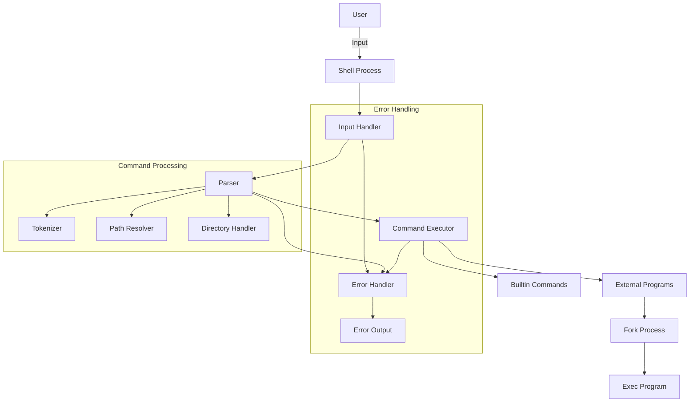
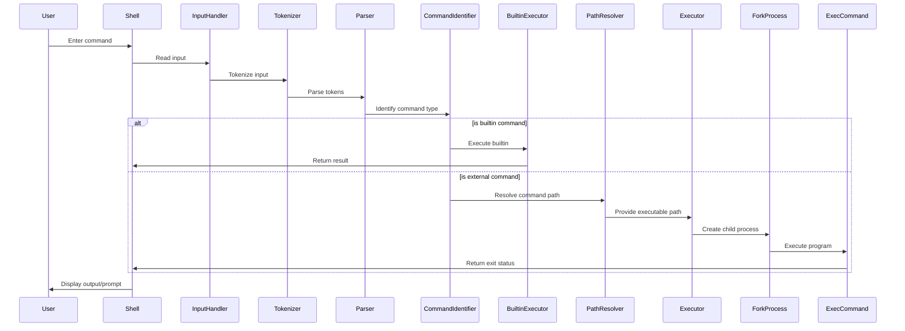
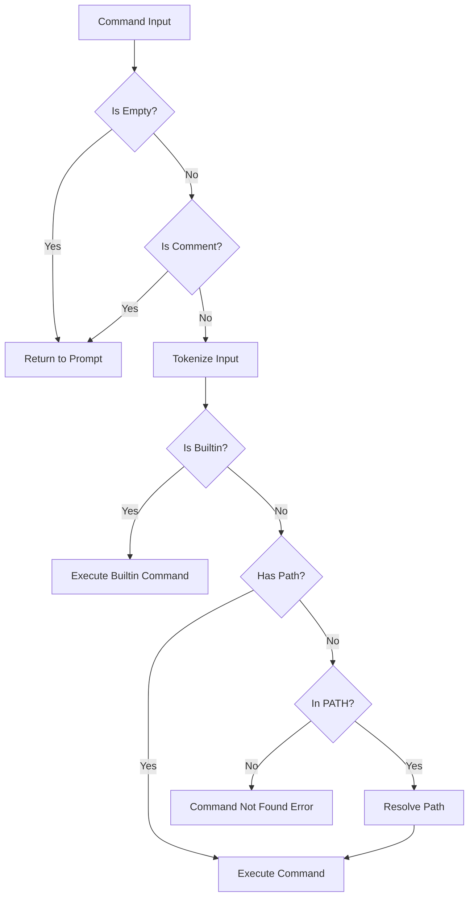
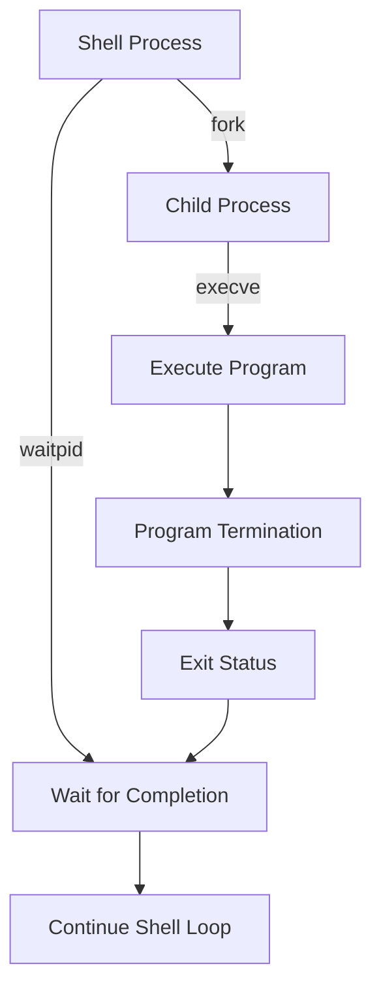
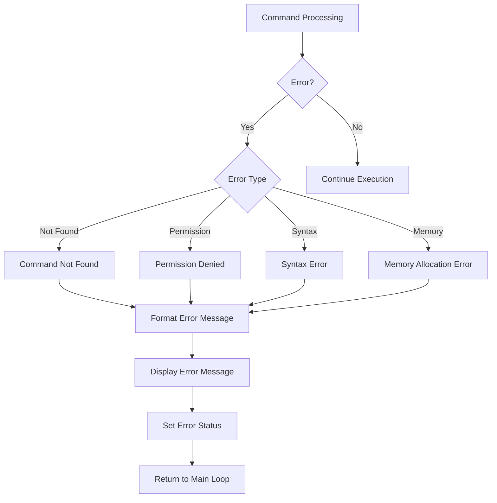

# Simple Shell - Architecture Overview

This document describes the architectural design of the Simple Shell implementation, highlighting the key components and their interactions.

## System Architecture

The Simple Shell follows a traditional command interpreter architecture with modular components for input handling, parsing, and execution:



## Component Details

### Main Process (`main.c`)
- **Entry Point**: Program execution starts here
- **Signal Handling**: Manages interrupts like Ctrl+C
- **Input Loop**: Continuously reads, parses, and executes commands
- **Process Management**: Parent process that forks child processes for commands

### Input Processing
- **Line Reading (`_getline.c`)**: Reads user input from standard input
- **Tokenization**: Splits input into words using delimiter characters
- **Command Preparation**: Prepares the command structure for execution

### Command Parsing (`parser.c`)
- **Command Type Identification**: Determines if command is builtin or external
- **Path Resolution (`path_parse.c`)**: Finds full path of commands in PATH
- **Directory Handling**: Handles directory operations and navigation

### Command Execution
- **Builtin Commands**: Implements shell internal commands like `cd`, `exit`, `help`
- **External Commands**: Executes programs using fork and exec
- **Process Creation**: Creates child processes to run external commands
- **Status Handling**: Captures and reports command exit status

### Memory Management
- **List Handling (`lists.c`, `list_handler.c`)**: Manages linked lists for shell data
- **Dynamic Memory**: Allocates and frees memory for commands and arguments
- **Resource Cleanup**: Ensures proper release of all allocated resources

### Error Handling (`error.c`)
- **Error Detection**: Identifies various error conditions
- **Error Reporting**: Formats and displays appropriate error messages
- **Status Codes**: Returns appropriate exit codes for different error types

## Implementation Details

### Command Processing Workflow

The shell follows a standard read-parse-execute workflow:

1. **Read Input**: Read a line from standard input using custom getline
2. **Tokenize**: Split the line into tokens using whitespace as delimiters
3. **Parse**: Interpret the tokens to identify the command and arguments
4. **Execute**: Execute the command and handle its result
5. **Repeat**: Return to the prompt and repeat the process

### Main Loop Implementation

The main loop in `main.c` handles the shell's primary functionality:

```c
do {
    ++(cmd_info.count);
    if (readline(&cmd_info) && isatty(STDIN_FILENO))
        continue;

    tokenizer(&cmd_info);
    if (!cmd_info.args)
        break;

    ret = run_args(&cmd_info);
    if (ret && ret != EXIT_LOOP)
    {
        cmd_info.status = get_error(&cmd_info, ret);
        if (isatty(STDIN_FILENO))
        {
            clean_up(&cmd_info);
            continue;
        }
        else
            break;
    }
    clean_up(&cmd_info);

} while (ret != EXIT_LOOP);
```

This loop reads input, processes it, and handles errors while maintaining interactive and non-interactive modes.

## Data Flow

The shell follows this basic data flow:



## Key Mechanisms

### Command Parsing Logic



### Process Control

The shell uses a parent-child process model for command execution:



### Key Components Implementation

#### Input Reading

The `readline` function in `main.c` handles input from standard input:

```c
int readline(CommandInfo *cmd_info)
{
    char *input = NULL;
    size_t bufsize = BUF_SIZE;
    int chars_count;

    if (isatty(STDIN_FILENO))
        _puts(PROMPT);

    chars_count = getline(&input, &bufsize, stdin);

    if (chars_count == -1 || is_whitespace(input))
    {
        free(input);
        return (1);
    }
    if (chars_count > 0 && input[chars_count - 1] == '\n')
        input[chars_count - 1] = '\0';

    cmd_info->line = input;

    return (0);
}
```

#### Command Execution

The `execute` function handles the execution of external commands:

```c
int execute(CommandInfo *cmd_info)
{
    pid_t child_pid;
    int status;

    if (access(cmd_info->command, F_OK) != 0 || is_directory(cmd_info->command))
        return (127); /* File doesn't exist */
    if (access(cmd_info->command, X_OK))
        return (126); /* Permission denied */

    child_pid = fork();
    if (child_pid == 0)
    {
        if (execve(cmd_info->command, cmd_info->args, cmd_info->env) == -1)
            return (127); /* Not found */
    }
    else
        do {
            waitpid(child_pid, &status, WUNTRACED);
        } while (!WIFEXITED(status) && !WIFSIGNALED(status));

    return (0);
}
```

## Error Handling Strategy

Error handling is implemented throughout the shell:



## Design Decisions

### POSIX Compliance
The shell is designed to follow POSIX standards for command interpretation and execution, ensuring compatibility with standard shell behavior.

### Modular Design
Components are separated by functionality for easier maintenance and testing:
- Input handling is isolated from command execution
- Builtin commands are implemented as separate functions
- Path resolution is handled by dedicated functions

### Memory Safety
The shell implements careful memory management:
- Dynamically allocated memory is tracked and freed
- Buffer overflows are prevented by boundary checking
- Memory leaks are avoided through systematic cleanup

### Error Resilience
The shell is designed to continue operation after recoverable errors:
- Invalid commands do not crash the shell
- Memory allocation failures are handled gracefully
- System call failures are detected and reported

## Interactive vs. Non-interactive Mode

The shell operates in two modes:

1. **Interactive Mode**: When run from a terminal, displays prompts and handles signals
2. **Non-interactive Mode**: When input is piped or from a script, processes commands and exits

The shell detects the mode using `isatty(STDIN_FILENO)` and adjusts its behavior accordingly.

## Implementation Limitations

1. **Limited Job Control**: Basic process management without advanced job control
2. **Simple I/O Redirection**: Supports basic redirection without advanced features
3. **No Command History**: Does not maintain command history between sessions
4. **Limited Scripting**: Basic script execution without advanced scripting features

## Glossary

- **POSIX**: Portable Operating System Interface - a family of standards for maintaining compatibility between operating systems
- **Fork**: System call that creates a new process by duplicating the calling process
- **Exec**: Family of functions that replaces the current process image with a new process image
- **Waitpid**: System call that suspends execution of the calling process until a child process changes state
- **Process**: An instance of a computer program that is being executed
- **File Descriptor**: Abstract indicator for accessing files or other input/output resources
- **Environment Variable**: Dynamic-named value that can affect the way running processes behave
- **Signal**: Software interrupt delivered to a process
- **TTY**: Terminal - a special file representing a terminal device
- **PATH**: Environment variable specifying directories to search for executable files

## Further Reading

- [The Linux Programming Interface](https://man7.org/tlpi/) - Comprehensive guide to Linux and UNIX system programming
- [Advanced Programming in the UNIX Environment](https://www.pearson.com/en-us/subject-catalog/p/advanced-programming-in-the-unix-environment/P200000009597) - Classic book on UNIX programming
- [POSIX Standard](https://pubs.opengroup.org/onlinepubs/9699919799/) - Official POSIX standard documentation
- [Writing a Shell in C](https://brennan.io/2015/01/16/write-a-shell-in-c/) - Tutorial on shell implementation
- [GNU Bash Reference Manual](https://www.gnu.org/software/bash/manual/bash.html) - Comprehensive documentation on Bash shell features
